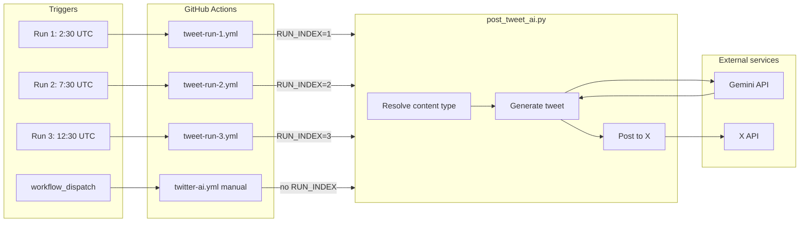

# Architecture and workflow

## High-level architecture



- **Triggers:** Three scheduled runs (8 AM, 1 PM, 6 PM IST) plus optional manual run.
- **Workflows:** Each run has its own workflow file and passes `RUN_INDEX` (1, 2, or 3). Manual run uses `twitter-ai.yml` and infers slot from time.
- **Script:** Reads `RUN_INDEX` + date → content type (rotation), calls Gemini for text (or poll), then posts via X API (or browser if `--post-via-browser`).

---

## Content type and rotation workflow

```mermaid
flowchart TB
    Start[Workflow runs]
    Env{RUN_INDEX set?}
    TimeSlot[Infer from UTC time]
    Date[Get day_of_year]
    Skip[Which type skipped: day % 4]
    Perm[Permutation of other 3 types]
    Assign[Assign type to this run]
    SkipRun{Deterministic skip?}
    ExitSkip[Exit without posting]
    CT[content_type: info | question | poll | cricket]
    Variant[Pick prompt variant by day + run]
    Gemini[Gemini generates text or poll]
    Parse{Poll?}
    APIPost[Post tweet via X API]
    PollPost[Post poll via X API]

    Start --> Env
    Env -->|No| TimeSlot
    Env -->|Yes| Date
    TimeSlot --> CT
    Date --> Skip
    Skip --> Perm
    Perm --> Assign
    Assign --> CT
    CT --> SkipRun
    SkipRun -->|Yes ~5%| ExitSkip
    SkipRun -->|No| Variant
    Variant --> Gemini
    Gemini --> Parse
    Parse -->|Poll with options| PollPost
    Parse -->|Plain text| APIPost
```

- **Rotation:** Four content types (info, question, poll, cricket). Each day one type is “skipped” (4-cycle); the other three are assigned to runs 1–3 in an order that rotates (6 permutations). So 8 AM / 1 PM / 6 PM do not always map to the same type.
- **Skip:** When `RUN_INDEX` is set, a deterministic ~5% skip per run so some days have only 2 tweets.
- **Variants:** Info, question, and cricket each have 2–3 prompt variants; chosen by `(day_of_year + RUN_INDEX) % num_variants`.

---

## Schedule and run mapping

| IST    | UTC     | Workflow         | RUN_INDEX |
|--------|---------|------------------|-----------|
| 8 AM   | 2:30    | tweet-run-1.yml  | 1         |
| 1 PM   | 7:30    | tweet-run-2.yml  | 2         |
| 6 PM   | 12:30   | tweet-run-3.yml  | 3         |

Manual run: **Tweet (AI, manual)** in `twitter-ai.yml` — no schedule, no `RUN_INDEX`; content type inferred from current time (info / question / poll).

---

## Content types and prompt flow


All prompts share: `ANTI_AI_RULES`, `HUMAN_STYLE`, `VARIETY_RULES` (and tech types use `X_FORMATTING`). Output: plain text for info/question/cricket; for poll, first line = question, following lines = 2–4 options.

---

## Secrets and environment

| Source   | Used by              | Purpose                    |
|----------|----------------------|----------------------------|
| GitHub   | All tweet workflows   | `GEMINI_API_KEY`, `TWITTER_*` |
| Env      | post_tweet_ai.py      | `RUN_INDEX` (1/2/3), optional `SLOT` |

No persistent state: content type and skip are derived from date + `RUN_INDEX` only.
